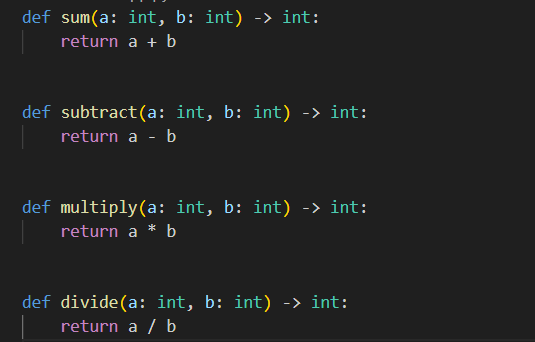
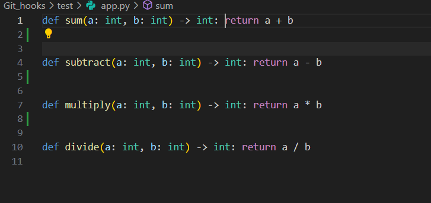
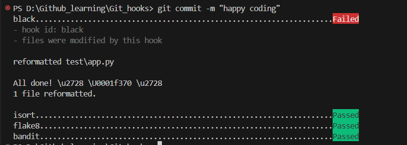

# 🐍 Python Pre-commit Hooks Guide

A guide to automated code quality using **pre-commit**, **Black**, **isort**, **flake8**, and **Bandit**.

---

## 🤔 What is Pre-commit?

| Term | Meaning |
|------|---------|
| **Git Event** | The moment right before a commit is finalized |
| **Pre-commit Tool** | A Python framework (`pip install pre-commit`) that manages hooks easily |

> **Why use the tool?** Writing raw Git hooks requires complex Bash scripts. Pre-commit lets you use a simple `.yaml` config file instead.

---

## 🛠️ The Tools

### 1. 📏 PEP 8 - The Rulebook

PEP 8 is Python's "grammar rules" for consistent code style.

| Rule | Example |
|------|---------|
| Line length | Max 88 characters |
| Indentation | 4 spaces (not tabs) |
| Variables/Functions | `snake_case` → `my_variable` |
| Classes | `CamelCase` → `MyClass` |

---

### 2. � Black - The Auto-Formatter

Black rewrites messy code to follow PEP 8 automatically.

```python
# ❌ Before Black
x = { 'a':1, 'b': 2}
def foo( x,y ):return x+y

# ✅ After Black
x = {"a": 1, "b": 2}
def foo(x, y):
    return x + y
```

---

### 3. 📚 isort - The Import Organizer

Sorts imports alphabetically and by type.

```python
# ❌ Before isort
import my_module
import sys
import pandas

# ✅ After isort
import sys           # Standard library

import pandas        # Third-party

import my_module     # Local
```

---

### 4. 🔍 flake8 - The Code Inspector

A linter that catches logic errors and bad habits.

```python
# flake8 catches:
x = 10  # ⚠️ F841: variable 'x' assigned but never used
import os  # ⚠️ F401: 'os' imported but unused
```

---

### 5. 🛡️ Bandit - The Security Scanner

Finds security vulnerabilities in your code.

```python
# ⚠️ Bandit catches:
password = "admin123"  # Hardcoded password!
eval(user_input)       # Dangerous eval()!
```

---

## ⚡ Quick Setup

### Step 1: Install Tools

```bash
pip install black isort flake8 pre-commit bandit
```

### Step 2: Create Config File

Create `.pre-commit-config.yaml` in your project root:

```yaml
repos:
  - repo: https://github.com/psf/black
    rev: 23.12.1
    hooks:
      - id: black

  - repo: https://github.com/pycqa/isort
    rev: 5.13.2
    hooks:
      - id: isort

  - repo: https://github.com/pycqa/flake8
    rev: 7.0.0
    hooks:
      - id: flake8

  - repo: https://github.com/PyCQA/bandit
    rev: 1.7.7
    hooks:
      - id: bandit
        args: ["-iii", "-ll"]  # Skip low severity issues
```

### Step 3: Activate Hooks

```bash
pre-commit install
```

---

## 🔄 The Workflow

```
You type: git commit -m "Add feature"
                ↓
    Pre-commit wakes up 🚨
                ↓
    Runs Black → isort → flake8 → Bandit
                ↓
    ┌─────────────────────────────────┐
    │  All pass? → ✅ Commit succeeds │
    │  Something fails? → ❌ Blocked  │
    └─────────────────────────────────┘
```

---

## 📋 Example Run

```bash
$ git commit -m "Add new feature"

black....................................................................Passed
isort....................................................................Passed
flake8...................................................................Failed
- hook id: flake8
- exit code: 1

example.py:5:1: F401 'os' imported but unused

# Fix the issue, then commit again!
```

---

## 📸 Step-by-Step Example with Screenshots

Here's a real-world example demonstrating how pre-commit hooks work in practice:

### Step 1: The Code Before Formatting

Suppose you have a Python file (`app.py`) with functions that don't follow proper formatting standards - all on single lines:



```python
def sum(a: int, b: int) -> int: return a + b

def subtract(a: int, b: int) -> int: return a - b

def multiply(a: int, b: int) -> int: return a * b

def divide(a: int, b: int) -> int: return a / b
```

### Step 2: View in Your Editor

This is how the code looks in VS Code before committing:



### Step 3: Attempt to Commit

When you try to commit this code, the pre-commit hooks automatically run:

```bash
git commit -m "happy coding"
```



**What Happened?**
| Hook | Status | Explanation |
|------|--------|-------------|
| **black** | ⚠️ Failed | Black found formatting issues and **automatically reformatted** `test\app.py` |
| **isort** | ✅ Passed | Imports were already properly organized |
| **flake8** | ✅ Passed | No linting errors found |
| **bandit** | ✅ Passed | No security vulnerabilities detected |

### Step 4: The Code After Black Reformats

After Black runs, your code is automatically reformatted to follow PEP 8:

```python
def sum(a: int, b: int) -> int:
    return a + b


def subtract(a: int, b: int) -> int:
    return a - b


def multiply(a: int, b: int) -> int:
    return a * b


def divide(a: int, b: int) -> int:
    return a / b
```

### Step 5: Commit Again

Since Black modified your files, simply stage the changes and commit again:

```bash
git add .
git commit -m "happy coding"
```

This time, all hooks will pass and your commit will succeed! ✅

---

## 🎯 Command Cheat Sheet

| Command | Purpose |
|---------|---------|
| `pre-commit install` | Set up hooks (run once) |
| `pre-commit run --all-files` | Run on all files manually |
| `pre-commit autoupdate` | Update hook versions |
| `black .` | Format all Python files |
| `isort .` | Sort all imports |
| `flake8 .` | Lint all files |
| `bandit -r .` | Security scan all files |

---

## 📁 Project Structure

```
my-project/
├── .pre-commit-config.yaml   ← Hook configuration
├── .git/
│   └── hooks/
│       └── pre-commit        ← Auto-generated by pre-commit
├── src/
│   └── main.py
└── README.md
```

---

## ✨ Why Use Pre-commit?

| Benefit | Description |
|---------|-------------|
| **Ease of Use** | Simple YAML config, no script writing |
| **Consistency** | Same tool versions for all team members |
| **Isolation** | Tools installed in separate environment |
| **Automation** | Runs automatically on every commit |

---

> 💡 **Pro Tip:** Run `pre-commit run --all-files` after initial setup to fix existing code!

Happy coding! 
